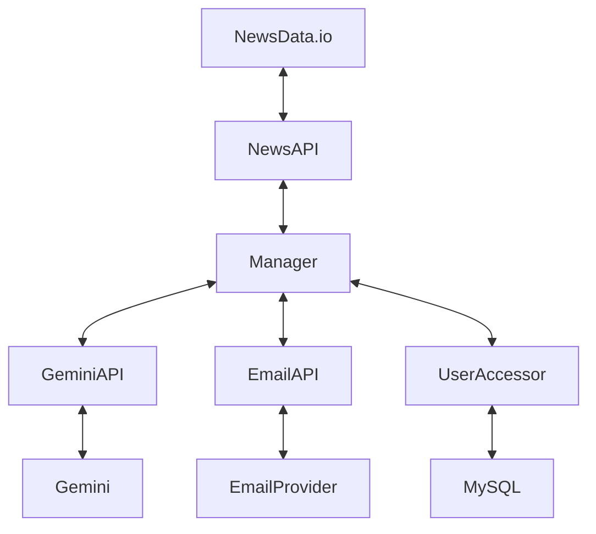

# NewsAggregator
## Idea
The purpose of the system is to fetch the latest news for a user, using the prefered subjects entered.

Each user will have an account and will be able to change the preferences at any time.
The preferences will be sent to the user via EMAIL.

## Running the application
To run the application you only need to open the solution and press the start button on visual studio

otherwise on terminal write:
"docker compose up"

and open "http://localhost:9020/swagger/index.html"

## The technologies used
    - docker
    - docker compose
    - dapr
    - RESTful api
    - MySQL
    - SQL queries

## Design

# Currently
 The application can get email and save data.

 works with docker, dapr and MySQL

 The application cannot yet connect to Email or get data from NewsData.io/Gemini